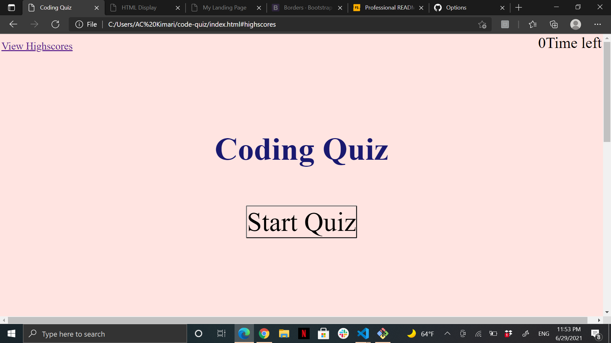
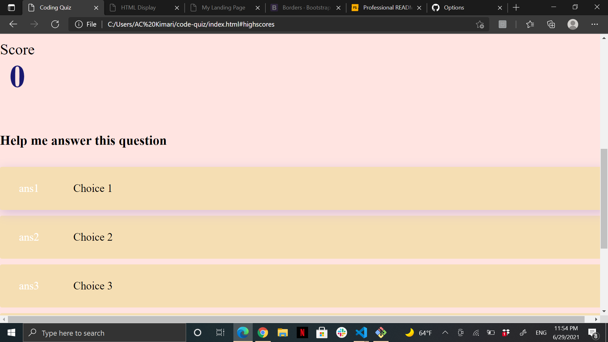
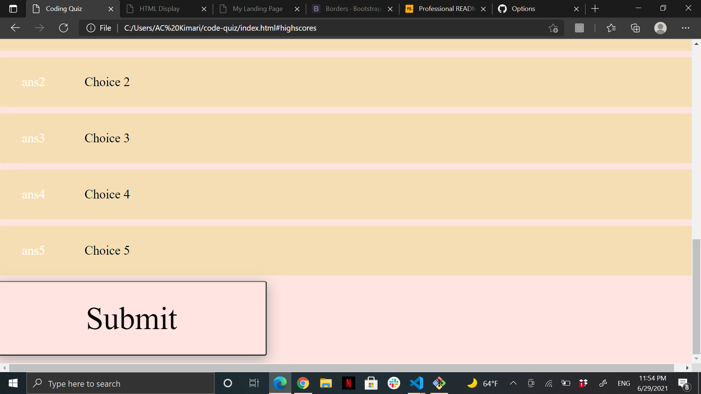

# code-quiz

## Description

My motivation for this project was my last project grade that wasn't so great. It allowed me to push harder and seek better resources. Moreover, I built this project to understand the coding behind quizes. I genuinely never questioned the amount of work done to create a quoz from scratch using codes, but now I have come to appreciate the amount of work put into creating it. 

This project solves the problem of loosing data as we include a local storage to save data for eternity unless discarded. Therefore, I learned the importance of including a local storage to your work that collects data. 

Finally, my project is an example to those who lack knowledge in coding that a little effort goes a long way, even if the overall task is incomplete.

## Installation

Step 1: Create a repositary on GitHub and code it on VS Code.

Step 2: Once you're on VS Code create HTML, CSS and Javascript files.

Step 3: Start with your HTML coding by layering out your website for the quiz.

Step 4: Create a start button that when clicked opens to the first question.

Step 5: Have a timer that begins when the start button is clicked.

Step 6: When the answer is correct have a text that indicates this before moving to the next question and vice versa.

Step 7: When a question is answered incorrectly, have the time decrease by 10 or 15 secomds.

Step 8: When all questions are answered or timer reaches 0, the quiz should end.

Step 9: Create a local storage for the scores and information collected, such as Initials of the person who took the quiz, at the end of the quiz.

Step 10: Inspect your website to ensure everything is in order.

## Usage

## Credits

Design, Brian. “How to Make a Quiz App Using HTML CSS Javascript - Vanilla Javascript Project for Beginners Tutorial.” YouTube, June 28, 2020. https://youtu.be/f4fB9Xg2JEY. 